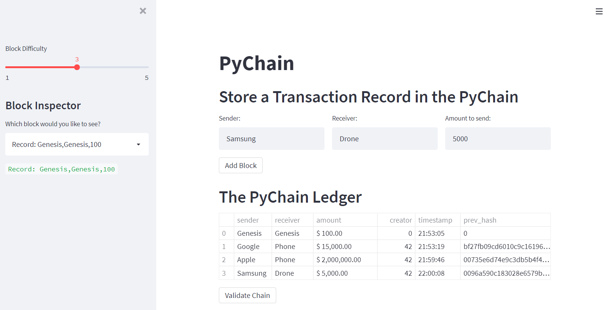
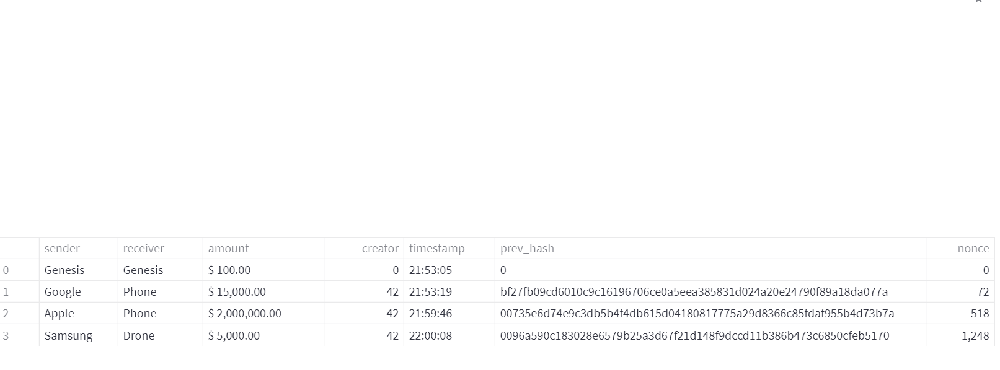
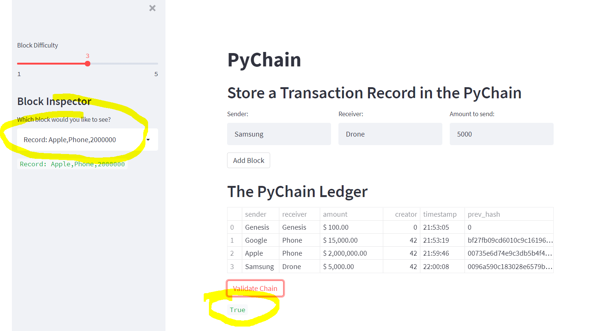

# Homework Module 1

## PyChain HW Project
- followed instructions to the HW set in the activities and started file pychain.py

### Extra Work
- added a dataframe builder to make sure dataframe gets displayed on the screen. the started file has a problem dealing with the record class
- added __repr__ and __str__ methods to the dataclass to deal with debugging and printing a more user friendly object

## Files
1.  pychain.py
2.  pychain_hw_pic1.PNG  
3.  pychain_hw_pic2.PNG  
3.  pychain_hw_pic3.PNG

## Summary
Here you can find the output after adding four records to the blockchain.

Here you can see a dataframe zoom when pressing the "expand" button

Using the validate button and running the validator

