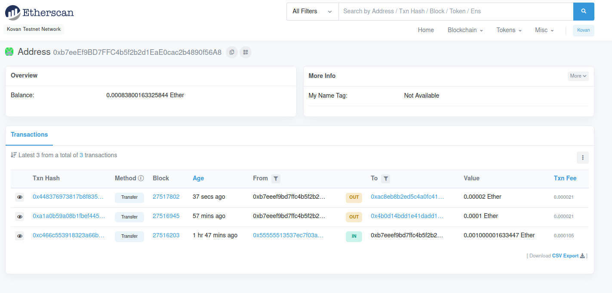
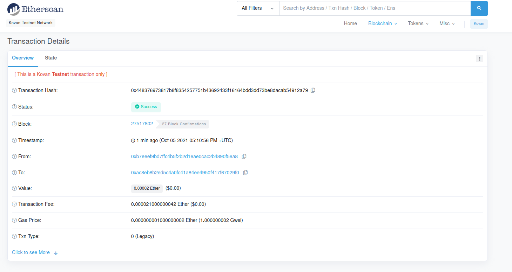
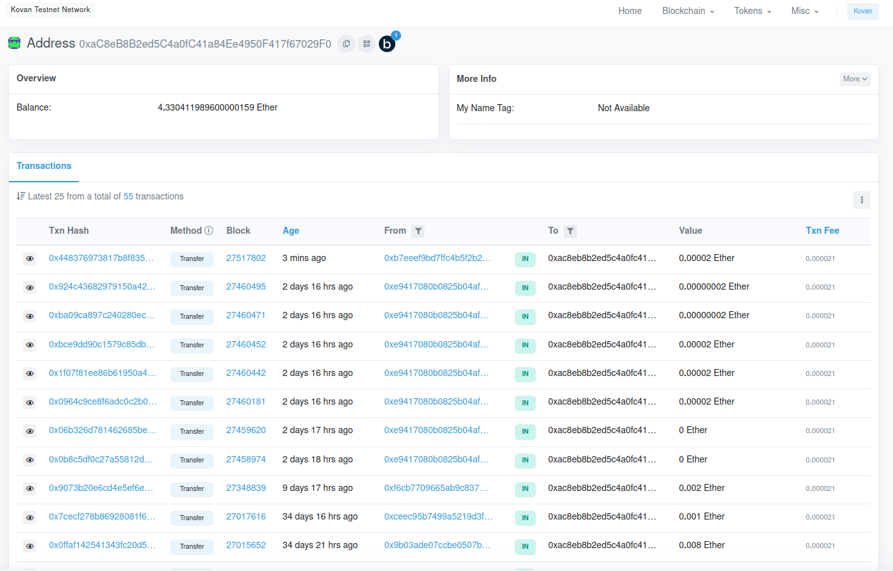

# Homework Module 2

## Ether HW
- followed instructions to the HW set in the activities and started file crypto_wallet.py and fintech_finder.py

### Notes
- had to remove dotenv library from usage as it was giving an error when used via streamlit application
- created the variables via terminal bash command
```bash
export VAR='VALUE' # did not include actual value here, but it is in the os env, otherwise it would not run
```

## Files
1.  *.py
2.  *.PNG screenshots

## Results

App Screenshot


First screenshot of the etherscan.

Hash transaction details

Transaction to address
