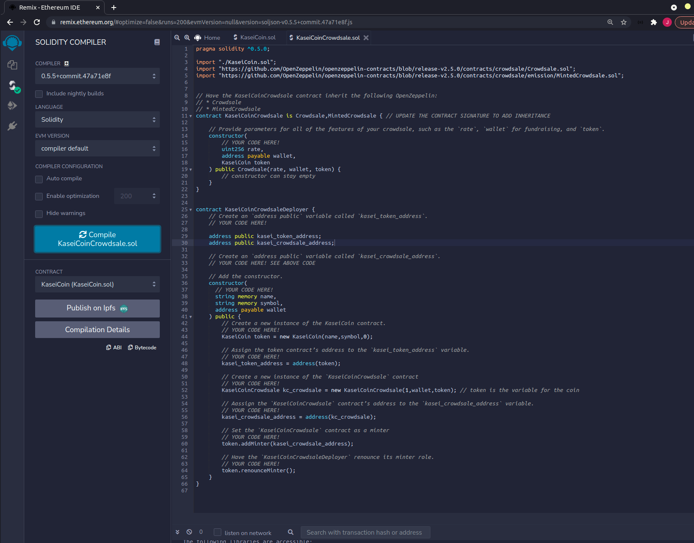
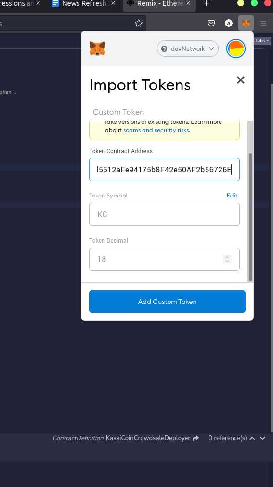

# KaiseCoin Project
- ERC-20 compliant

# libs used
- OpenZepplin

# Tools used
- Solidity (ver 0.5.0)
- Compiler for Crowdsale and MintedCrowdsale giving error that it needs 0.5.5+

# Evaluation Screenshots

Compilation Images

Ganache

Remix

Metamask

